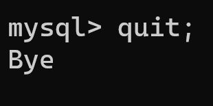
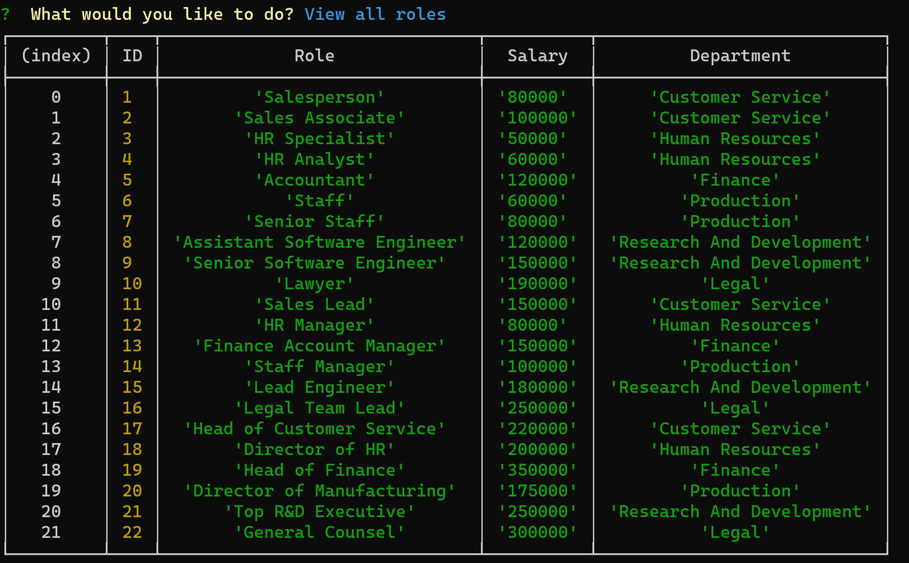

# Employee Manager App

## Description
  
As a way to help business owners and chief executives of small to medium-sized companies keep track of their human resources and departments and easily create or delete records from their databases, we created the CMS (Content Management System) known as Employee Manager. This CLI app will allow to search and modify information in an user-friendly manner without having to deal
with complicated SQL queries or use a MySQL shell or GUI. The results of each action taken will be either shown as a formatted table or as a descriptive distictly formatted text that can be easily parsed from the rest of the messages in the terminal. This first foray into CMS gave the author the opportunity to learn more about SQL queries, especially those that depend on prepared statements that can be passed using the .query method of "mysql2", and the use of promises, either by creating Promise objects or chaining .then's in order to handle asynchronous processes started by user inputs (the inputs are handled using the Inquirer interface). Among other things, he practiced the declaration and assignment of environmental variables in order to protect data from reaching unscrupulous hands and the rudiments of creating and displaying ASCII art in the Git Bash terminal.

## Table of Contents

- [Installation](#installation)
- [Usage](#usage)
- [Credits](#credits)
- [License](#license)

## Installation

The open source project is available at <https://github.com/jguemarez/EmployeeManagerApp> . Once you create a directory for it, navigate into it and clone the remote repo, you install the dependencies by entering the command "npm i" in the terminal. After a package-lock.json file with the dependency tree and a node-modules folder has been created, create a .env file in the root folder in order to declare and initialize the environmental variables whose names appear in the 'connection.js' file of the 'config' folder. After that, the app will be ready to use.

## Usage

1. Open Git Bash and navigate to the directory containing the node application:

2. Log into the MySQL Shell and enter the following command:

3. Exit the Shell with "exit;" or :

4. After entering either "npm start" or "node index" in the terminal, you will see the logo for the app, a welcoming message and the select menu:

5. After selecting 'View all departments':

6. After selecting 'View all roles':

7. After selecting 'View all employees':

8. After selecting 'View all department managers':

9. After selecting 'View all department directors':

10. After selecting 'View employees by department':

11. After selecting 'View employees by manager':

12. After selecting 'Add a department':

13. After selecting 'Add a role':

14. After selecting 'Add a regular employee':

If the department is a core department and already has available managers, you choose the manager from a list of available managers at the department the employee is assigned:

If the department has been newly created and it does not have any managers assigned to it, a temporary  manager is chosen at random:

15. After selecting 'Update a regular employee':

Error message if you try to update a nonexistent record:

Successful updating an existing record:

16. After selecting 'Update a manager':

If the employee is already a manger, the process goes like this:

Else (if an employee is promoted to manager):

17. After selecting 'Delete a regular employee's record':

18. After selecting 'Dispose of a regular role':

NB: The role is chosen from a list of non-management roles.

19. After selecting 'Close a department':

20. After selecting 'Get the total utilized budget of a department':

21. In order to close the app and end the connection to business_db you can press Ctrl + C or choose:

## Credits

The project is of the authorship of Jonathan Maldonado.The GitHub repo can be found at: <https://github.com/jguemarez/EmployeeManagerApp> .
A walkthrough video for the app was uploaded to Google Drive and can be viewed at: <https://drive.google.com/file/d/1GG6-XvKEc-t5ANIVCqcbTZSThnf8N7M-/view?usp=drive_link>
The .gitignore file was lifted from the GitLab class repo found at: <https://git.bootcampcontent.com>.

The folder structure of the project has been adapted from those found in the activities for Module 11 and Module 12 of the Rutgers Full Stack Bootcamp.

In order to create and populate our database we use the MySQL Shell Server version: 8.1.0 MySQL Community Server - GPL, that can be downloaded from: <https://dev.mysql.com/downloads/shell/>

This app was designed to work in the Node.js JavaScript runtime environment, especifically v18.17.1 for Windows OS. The latest stable (recommended version) can be found at: <https://nodejs.org/en/download>

We use npm for the specification (semantic versioning) of the app's dependencies and their installation. Here is the URL for the official site of the npm registry: <https://www.npmjs.com>

In particular, we added the node packages "dotenv":"^16.3.1" (in order to secure sensitive data used in the app's configuration), "mysql2": "^3.6.1", and "inquirer": "^8.2.4" to the dependencies. You can find the most recent versions of the node packages (along with documentation) here:

<https://www.npmjs.com/package/env> for DotEnv; <https://www.npmjs.com/package/mysql2> for MySQL2; and <https://www.npmjs.com/package/inquirer> for Inquirer.

In order to create the logo that appears in the terminal during the app's initialization we used the Text tO ASCII Art Generator app that can be found at: <https://patorjk.com/software/taag>

For the purpose of populating the tables with a non-trivial amount of data, we extracted much of the rows and field values in them from the "tes_db" sample database by datacharmer, whose files can be cloned from: <https://github.com/datacharmer/test_db>

## How to Contribute

If you want to contribute, feel free to fork the repo, modify the repo on your local machine and then open a pull request. That way I can review the changes before deciding whther to merge them in the codebase or not.

## Tests

The app was manually tested multiple times before deployment by its author, checking for errors both in the browser's (Google Chrome DevTools for the front end) console and in the terminal (Git Bash for the back end). Before connecting the back-end to the front-end, some endpoints were tested using Insomnia 2023.5.17 as a client.

However, the user should keep an eye for any error thrown in the console and, if possible, open an issue in the GitHub repo detailing the bug. In the future, it would be interesting to devise some tests using a node package like JEST (documentation available at: <https://jestjs.io/docs>.)

## Questions

My GitHub username is "jguemarez" and you can checkout my profile at: <https://www.github.com/jguemarez>.
For further questions and comments, you can mail them to the following address: <cantor.dedekind112358@gmail.com>.

## License

This is an open-source project under the terms of agreement provided by the MIT license. For more information, click on the following link: <https://opensource.org/license/mit>
